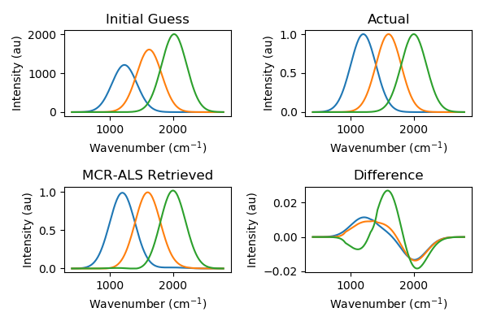
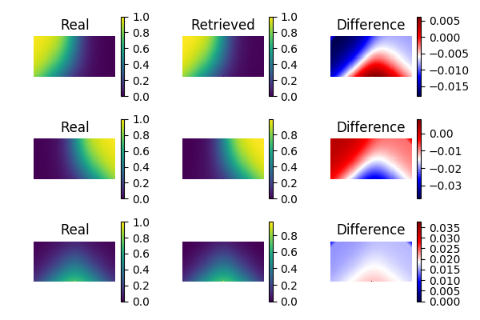

.. -*- mode: rst -*-

.. image:: https://github.com/CCampJr/pyMCR/actions/workflows/python-app.yml/badge.svg
    :alt: pytest
    :target: https://github.com/CCampJr/pyMCR/actions/workflows/python-app.yml
    
.. image:: https://codecov.io/gh/CCampJr/pyMCR/branch/master/graph/badge.svg
    :alt: Codecov
    :target: https://codecov.io/gh/CCampJr/pyMCR

.. image:: https://img.shields.io/pypi/pyversions/pyMCR.svg
    :alt: PyPI - Python Version
    :target: https://pypi.org/project/pyMCR/

.. image:: https://img.shields.io/pypi/v/pyMCR.svg
    :alt: PyPI Project Page
    :target: https://pypi.org/project/pyMCR/

.. image:: https://anaconda.org/conda-forge/pymcr/badges/version.svg
    :alt: Anaconda Cloud
    :target: https://anaconda.org/conda-forge/pymcr

.. image:: https://img.shields.io/badge/License-NIST%20Public%20Domain-green.svg
    :alt: NIST Public Domain
    :target: https://github.com/usnistgov/pyMCR/blob/master/LICENSE.md

pyMCR: Multivariate Curve Resolution in Python
===============================================================

Documentation available online at https://pages.nist.gov/pyMCR

Software DOI: https://doi.org/10.18434/M32064

Manuscript DOI: https://doi.org/10.6028/jres.124.018

pyMCR is a small package for performing multivariate curve resolution.
Currently, it implements a simple alternating regression scheme (MCR-AR). The most common
implementation is with ordinary least-squares regression, MCR-ALS.

MCR with non-negativity constraints on both matrices is the same as non-negative matrix factorization (NMF). Historically,
other names were used for MCR as well:

-   Self modeling mixture analysis (SMMA)
-   Self modeling curve resolution (SMCR)

Available methods:

-   Regressors:

    -   `Ordinary least squares <https://docs.scipy.org/doc/scipy/reference/generated/scipy.linalg.lstsq.html>`_ (default)
    -   `Non-negatively constrained least squares 
        <https://docs.scipy.org/doc/scipy/reference/generated/scipy.optimize.nnls.html>`_
    -   Native support for `scikit-learn linear model regressors 
        <http://scikit-learn.org/stable/modules/linear_model.html>`_
        (e.g., `LinearRegression <http://scikit-learn.org/stable/modules/linear_model.html#ordinary-least-squares>`_, 
        `RidgeRegression <http://scikit-learn.org/stable/modules/linear_model.html#ridge-regression>`_, 
        `Lasso <http://scikit-learn.org/stable/modules/linear_model.html#lasso>`_)

-   Constraints

    -   Non-negativity
    -   Normalization
    -   Zero end-points
    -   Zero (approx) end-points of cumulative summation (can specify nodes as well)
    -   Non-negativity of cumulative summation
    -   Compress or cut values above or below a threshold value
    -   Replace sum-across-features samples (e.g., 0 concentration) with prescribed target
    -   Enforce a plane ("planarize"). E.g., a concentration image is a plane.

-   Error metrics / Loss function

    -   Mean-squared error

-   Other options

    -   Fix known targets (C and/or ST, and let others vary)

What it **does** do:

-   Approximate the concentration and spectral matrices via minimization routines. 
    This is the core the MCR methods.
-   Enable the application of certain constraints in a user-defined order.

What it **does not** do:

-   Estimate the number of components in the sample. This is a bonus feature in 
    some more-advanced MCR-ALS packages.

    - In MATLAB: https://mcrals.wordpress.com/
    - In R: https://cran.r-project.org/web/packages/ALS/index.html

Dependencies
------------

**Note**: These are the developmental system specs. Older versions of certain
packages may work.

-   python >= 3.4
    
    - Tested with 3.4.6, 3.5.4, 3.6.3, 3.6.5, 3.7.1

-   numpy (1.9.3)
    
    - Tested with 1.12.1, 1.13.1, 1.13.3, 1.14.3, 1.14.6

-   scipy (1.0.0)

    - Tested with 1.0.0, 1.0.1, 1.1.0

-   scikit-learn, optional (0.2.0)

Known Issues
------------

Installation
------------

Using pip (hard install)
~~~~~~~~~~~~~~~~~~~~~~~~

.. code::

    # Only Python 3.* installed
    pip install pyMCR

    # If you have both Python 2.* and 3.* you may need
    pip3 install pyMCR

Using pip (soft install [can update with git])
~~~~~~~~~~~~~~~~~~~~~~~~~~~~~~~~~~~~~~~~~~~~~~

.. code::
    
    # Make new directory for pyMCR and enter it
    # Clone from github
    git clone https://github.com/usnistgov/pyMCR

    # Only Python 3.* installed
    pip install -e .

    # If you have both Python 2.* and 3.* you may need instead
    pip3 install -e .

    # To update in the future
    git pull

Using setuptools
~~~~~~~~~~~~~~~~

You will need to `download the repository <https://github.com/usnistgov/pyMCR>`_
or clone the repository with git:

.. code::
    
    # Make new directory for pyMCR and enter it
    # Clone from github
    git clone https://github.com/usnistgov/pyMCR

Perform the install:

.. code::

    python setup.py install

Logging
--------

**New in pyMCR 0.4.*, the logging module is now automatically loaded and setup during import (via __init__.py) to print messages**. You do not need to do the logger setup below.

**New in pyMCR 0.3.1**, Python's native logging module is now used to capture messages. Though this is not as 
convenient as print() statements, it has many advantages.

- Logging module docs: https://docs.python.org/3.7/library/logging.html
- Logging tutorial: https://docs.python.org/3.7/howto/logging.html#logging-basic-tutorial
- Logging cookbook: https://docs.python.org/3.7/howto/logging-cookbook.html#logging-cookbook

A simple example that prints simplified logging messages to the stdout (command line):

.. code:: python

    import sys
    import logging
    
    # Need to import pymcr or mcr prior to setting up the logger
    from pymcr.mcr import McrAR

    logger = logging.getLogger('pymcr')
    logger.setLevel(logging.DEBUG)

    # StdOut is a "stream"; thus, StreamHandler
    stdout_handler = logging.StreamHandler(stream=sys.stdout)

    # Set the message format. Simple and removing log level or date info
    stdout_format = logging.Formatter('%(message)s')  # Just a basic message akin to print statements
    stdout_handler.setFormatter(stdout_format)

    logger.addHandler(stdout_handler)

    # Begin your code for pyMCR below
    

Usage
-----

.. code:: python

    from pymcr.mcr import McrAR
    mcrar = McrAR()
    
    # MCR assumes a system of the form: D = CS^T
    #
    # Data that you will provide (hyperspectral context):
    # D [n_pixels, n_frequencies]  # Hyperspectral image unraveled in space (2D)
    #
    # initial_spectra [n_components, n_frequencies]  ## S^T in the literature
    # OR
    # initial_conc [n_pixels, n_components]   ## C in the literature

    # If you have an initial estimate of the spectra
    mcrar.fit(D, ST=initial_spectra)

    # Otherwise, if you have an initial estimate of the concentrations
    mcrar.fit(D, C=initial_conc)

Example Results
---------------

Command line and Jupyter notebook examples are provided in the ``Examples/`` folder. Examples of instantiating
the McrAR class with different regressors available in the `documentation <https://pages.nist.gov/pyMCR>`_ .

From ``Examples/Demo.ipynb``:

Citing this Software
--------------------

If you use *pyMCR*, citing the following article is much appreciated:

-   `C. H. Camp Jr., "pyMCR: A Python Library for Multivariate Curve Resolution 
    Analysis with Alternating Regression (MCR-AR)", Journal of Research of 
    National Institute of Standards and Technology 124, 1-10 (2019)
    <https://doi.org/10.6028/jres.124.018>`_.

References
----------

-   `W. H. Lawton and E. A. Sylvestre, "Self Modeling Curve Resolution", 
    Technometrics 13, 617–633 (1971). <https://www.jstor.org/stable/1267173>`_
-   https://mcrals.wordpress.com/theory/
-   `J. Jaumot, R. Gargallo, A. de Juan, and R. Tauler, "A graphical user-friendly 
    interface for MCR-ALS: a new tool for multivariate curve resolution in
    MATLAB", Chemometrics and Intelligent Laboratory Systems 76, 101-110 
    (2005). <http://www.sciencedirect.com/science/article/pii/S0169743904002874>`_
-   `J. Felten, H. Hall, J. Jaumot, R. Tauler, A. de Juan, and A. Gorzsás, 
    "Vibrational spectroscopic image analysis of biological material using 
    multivariate curve resolution–alternating least squares (MCR-ALS)", Nature Protocols 
    10, 217-240 (2015). <https://www.nature.com/articles/nprot.2015.008>`_
    

LICENSE
----------
This software was developed by employees of the National Institute of Standards 
and Technology (NIST), an agency of the Federal Government. Pursuant to 
`title 17 United States Code Section 105 <http://www.copyright.gov/title17/92chap1.html#105>`_, 
works of NIST employees are not subject to copyright protection in the United States and are 
considered to be in the public domain. Permission to freely use, copy, modify, 
and distribute this software and its documentation without fee is hereby granted, 
provided that this notice and disclaimer of warranty appears in all copies.

THE SOFTWARE IS PROVIDED 'AS IS' WITHOUT ANY WARRANTY OF ANY KIND, EITHER 
EXPRESSED, IMPLIED, OR STATUTORY, INCLUDING, BUT NOT LIMITED TO, ANY WARRANTY 
THAT THE SOFTWARE WILL CONFORM TO SPECIFICATIONS, ANY IMPLIED WARRANTIES OF 
MERCHANTABILITY, FITNESS FOR A PARTICULAR PURPOSE, AND FREEDOM FROM INFRINGEMENT, 
AND ANY WARRANTY THAT THE DOCUMENTATION WILL CONFORM TO THE SOFTWARE, OR ANY 
WARRANTY THAT THE SOFTWARE WILL BE ERROR FREE. IN NO EVENT SHALL NIST BE LIABLE 
FOR ANY DAMAGES, INCLUDING, BUT NOT LIMITED TO, DIRECT, INDIRECT, SPECIAL OR 
CONSEQUENTIAL DAMAGES, ARISING OUT OF, RESULTING FROM, OR IN ANY WAY CONNECTED 
WITH THIS SOFTWARE, WHETHER OR NOT BASED UPON WARRANTY, CONTRACT, TORT, OR 
OTHERWISE, WHETHER OR NOT INJURY WAS SUSTAINED BY PERSONS OR PROPERTY OR 
OTHERWISE, AND WHETHER OR NOT LOSS WAS SUSTAINED FROM, OR AROSE OUT OF THE 
RESULTS OF, OR USE OF, THE SOFTWARE OR SERVICES PROVIDED HEREUNDER.

Contact
-------
Charles H Camp Jr: `charles.camp@nist.gov <mailto:charles.camp@nist.gov>`_

Contributors
-------------

-   Charles H Camp Jr
-   Charles Le Losq (charles.lelosq@anu.edu.au)
-   Robert Kern (rkern@enthought.com)
-   Joshua Taillon (joshua.taillon@nist.gov)
