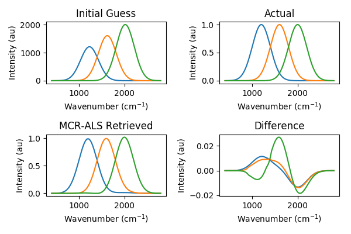

|
|

.. image:: https://travis-ci.com/CCampJr/pyMCR.svg?branch=0.4.X
    :alt: Travis CI Status
    :target: https://travis-ci.com/CCampJr/pyMCR

.. image:: https://ci.appveyor.com/api/projects/status/ajld1bj7jo4oweio/branch/0.4.X?svg=true
    :alt: AppVeyor CI Status
    :target: https://ci.appveyor.com/project/CCampJr/pyMCR

.. image:: https://codecov.io/gh/CCampJr/pyMCR/branch/0.4.X/graph/badge.svg
    :alt: Codecov
    :target: https://codecov.io/gh/CCampJr/pyMCR

.. image:: https://img.shields.io/pypi/pyversions/pyMCR.svg
    :alt: PyPI - Python Version
    :target: https://pypi.org/project/pyMCR/

.. image:: https://img.shields.io/pypi/v/pyMCR.svg
    :alt: PyPI Project Page
    :target: https://pypi.org/project/pyMCR/

.. image:: https://img.shields.io/badge/License-NIST%20Public%20Domain-green.svg
    :alt: NIST Public Domain
    :target: https://github.com/usnistgov/pyMCR/blob/master/LICENSE.md

pyMCR: Multivariate Curve Resolution in Python
===============================================

pyMCR is a small package for performing multivariate curve resolution.
Currently, it implements a simple alternating regression scheme (MCR-AR). The most common
implementation is with ordinary least-squares regression, MCR-ALS.

MCR with non0negativity constraints on both matrices is the same as nonnegative matrix factorization (NMF). Historically,
other names were used for MCR as well:

-   Self modeling mixture analysis (SMMA)
-   Self modeling curve resolution (SMCR)

Documentation
-------------

.. toctree::
   :maxdepth: 2
   :caption: User Docs

   installing
   usage
   license_link

.. toctree::
   :maxdepth: 1
   :caption: Developer Docs

   contribute_link
   license_link
   api
   modules

Available methods
-----------------

-   Regressors:

    -   `Ordinary least squares <https://docs.scipy.org/doc/scipy/reference/generated/scipy.linalg.lstsq.html>`_ (default)
    -   `Non-negatively constrained least squares 
        <https://docs.scipy.org/doc/scipy/reference/generated/scipy.optimize.nnls.html>`_
    -   Native support for `scikit-learn linear model regressors 
        <http://scikit-learn.org/stable/modules/linear_model.html>`_
        (e.g., `LinearRegression <http://scikit-learn.org/stable/modules/linear_model.html#ordinary-least-squares>`_, 
        `RidgeRegression <http://scikit-learn.org/stable/modules/linear_model.html#ridge-regression>`_, 
        `Lasso <http://scikit-learn.org/stable/modules/linear_model.html#lasso>`_)

-   Constraints

    -   Non-negativity
    -   Normalization
    -   Zero end-points
    -   Zero (approx) end-points of cumulative summation (can specify nodes as well)
    -   Non-negativity of cumulative summation
    -   Compress or cut values above or below a threshold value
    -   Replace sum-across-features samples (e.g., 0 concentration) with prescribed target
    -   Enforce a plane ("planarize"). E.g., a concentration image is a plane.

-   Error metrics / Loss function

    -   Mean-squared error

-   Other options

    -   Fix known targets (C and/or ST, and let others vary)

Software Design Philosophy
--------------------------

What it **does** do:

-   Approximate the concentration and spectral matrices via minimization routines. 
    This is the core the MCR methods.
-   Enable the application of certain constraints in a user-defined order.

What it **does not** do:

-   Estimate the number of components in the sample (though some tools tools may be provided in the future). This is a bonus feature in 
    some more-advanced MCR-ALS packages.

    - In MATLAB: https://mcrals.wordpress.com/
    - In R: https://cran.r-project.org/web/packages/ALS/index.html

Basic Usage
-----------

.. code:: python

    from pymcr.mcr import McrAR
    mcrar = McrAR()
    
    # MCR assumes a system of the form: D = CS^T
    #
    # Data that you will provide (hyperspectral context):
    # D [n_pixels, n_frequencies]  # Hyperspectral image unraveled in space (2D)
    #
    # initial_spectra [n_components, n_frequencies]  ## S^T in the literature
    # OR
    # initial_conc [n_pixels, n_components]   ## C in the literature

    # If you have an initial estimate of the spectra
    mcrar.fit(D, ST=initial_spectra)

    # Otherwise, if you have an initial estimate of the concentrations
    mcrar.fit(D, C=initial_conc)

Example Results
----------------

Command line and Jupyter notebook examples are provided in the ``Examples/`` folder.

From ``Examples/Demo.ipynb``:

.. image:: ./_static/mcr_conc_retr.png

Citing this Software
--------------------

Coming soon...

References
----------

-   `W. H. Lawton and E. A. Sylvestre, "Self Modeling Curve Resolution", 
    Technometrics 13, 617–633 (1971). <https://www.jstor.org/stable/1267173>`_
-   https://mcrals.wordpress.com/theory/
-   `J. Jaumot, R. Gargallo, A. de Juan, and R. Tauler, "A graphical user-friendly 
    interface for MCR-ALS: a new tool for multivariate curve resolution in
    MATLAB", Chemometrics and Intelligent Laboratory Systems 76, 101-110 
    (2005). <http://www.sciencedirect.com/science/article/pii/S0169743904002874>`_
-   `J. Felten, H. Hall, J. Jaumot, R. Tauler, A. de Juan, and A. Gorzsás, 
    "Vibrational spectroscopic image analysis of biological material using 
    multivariate curve resolution–alternating least squares (MCR-ALS)", Nature Protocols 
    10, 217-240 (2015). <https://www.nature.com/articles/nprot.2015.008>`_
    

Indices and tables
==================

* :ref:`genindex`
* :ref:`modindex`
* :ref:`search`
